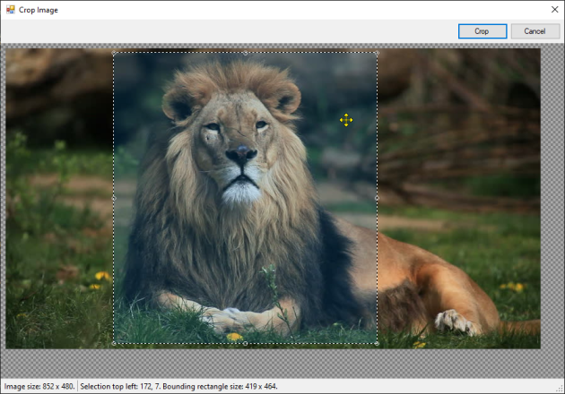

# Image Cropping Demo

This project was my sandbox for playing with an image editor that allows a user to
select a region from an image and crop that image to that region.

* The region is selected as a rectangle
* The selection is done using a common rubber-banding approach
* The region is outlined using a "marching ants" pattern
* Resize handles are provided to grab corners or sides
* Handles are drawn as white or gray depending on the brightness of the image
* A narrow border is added to make it easier to select the edges with the mouse

